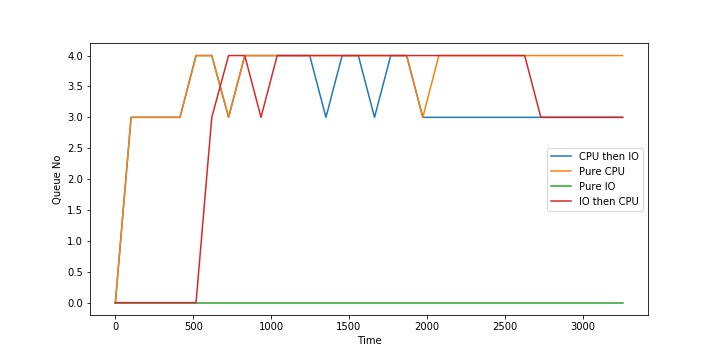

### Assignment on modifying XV6 kernel 
Pulak Malhotra, 2019101050

### Implementation:
1. Changing proc structure and time command
- Added ctime, etime, iotime and rtime
- Changed ctime in allocproc and etime in exit
- Updated rtime in timer interrupt of trap function
- Added waitx system call which gets the rtime and wtime of first zombie
- Implemented time command using exec and waitx system call

2. PS command
- Made a system call called get_ps() which prints all the detail of the proc structures with pid > 0 after acquiring the ptable lock
- Implemented ps command which just calls this system call
- Further improvement : dont print directly from kernel

3. Schedulers 
- I have a different file for each scheduler that gets compiled according to the given flag value. Each scheduler has its own scheduler and trap function
- FCFS
    - Do not call yielding in trap
    - Use ctime to get min ctime process and run that
- PBS
    - A set prio sys call to change the priority
    - Run the process with the least priority
    - after running the process find the min prio (if it changed during execution)
    - run the process with min prio again
- MLFQ 
    - The proc structure now stores time of entry (toe) of each process, cur_q, time spent in each queue, ticks it has left before getting preempted
    - Go through all process with decreasing priority to find one in runnable state and run it
    - After it is run and it completed the time slice move it down a queue
    - If it did not complete time slice dont change its queue
    - Also check for aging in all processes
    - Aging wait time is currently (1 << (level + 4)) for a level
    - In trap only yield if the process has done its alloted ticks

I ran the benchmark.c file for all the schedulers and observed the following in it: 
Benchmark spawns total 50 processes which alternate between the following types:
- Pure CPU
- Pure IO
- First CPU then IO
- First IO then CPU
For each type of scheduler I have noted down the end time of the different types of processes and the total time for benchmark process.

### MLFQ
- Time 3194 ticks 
- First pure IO
- Then IO then CPU
- Then CPU then IO
- Then pure CPU

### FCFS
- Time 3841 ticks 
- First CPU bound (in ascending order)
- Then mixed CPU then IO and IO then CPU (in ascending order)
- Lastly Pure IO (in ascending order)
- There is some interleaving among categories but for each type they follow ascending order strictly

### PBS
- Total time 3255 ticks 
- First all odd procceses since they have lower priority by definition in benchmark
- Then all even processes
- Among odd and even 
    - First Pure IO
    - Then CPU then IO
    - Then IO then CPU
    - Then pure CPU

### RR (default)
- Total time is 3224 ticks 
- First Pure IO 
- CPU then IO
- IO then CPU
- Pure CPU

### BONUS 

